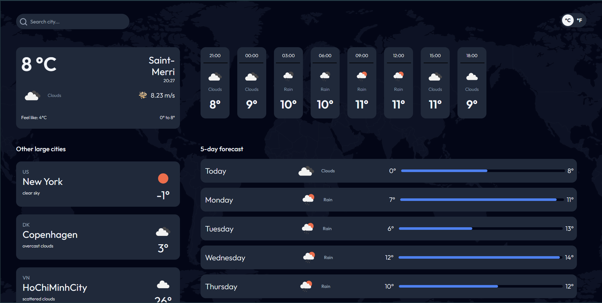
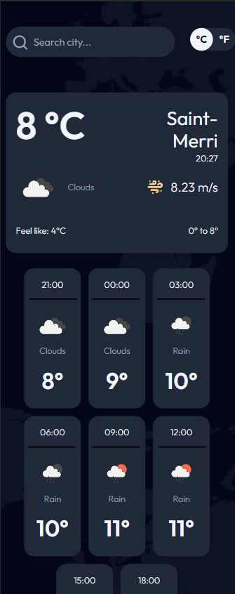

Il s'agit d'une solution pour le défi [Weather App](https://devchallenges.io/challenge/52) sur Dev Challenges.

## Table des matières

- [Aperçu](#aperçu)
  - [Le défi](#le-défi)
  - [Capture d'écran](#capture-décran)
  - [Liens](#liens)
  - [Construit avec](#construit-avec)
- [Auteur](#auteur)

## Aperçu

### Le défi

- Les utilisateurs doit pouvoir voir : 
    - La température, le lieu, l'heure, le vent, la température haute/basse, le statut météorologique du lieu sélectionné.

    - La température des 24 heures à venir avec des intervalles de 3 heures.
    
    - Voir les prévisions pour les 5 prochains jours avec l'état de la météo et les températures basses/hautes.

    - Choisir d'afficher la température en Celsius ou en Fahrenheit.

    - Rechercher une ville et voir sa météo

### Capture d'écran

### Liens

- [URL du site en direct](https://weather-app-b-alexandre.netlify.app)

### Construit avec

- Vite (Framework React)
- TailwindCSS
- React Context

## Auteur

- Dev Challenge - [@CallMeAl3x](https://devchallenges.io/profile/4b9e326e-7fac-4811-b859-ca80373be3dd)